# Visual overview

These diagrams show what the skill does. GitHub draws them from the Mermaid source below. `SKILL.md` and `references/` stay the source of truth; the labels use their heading names.

1. [What is in the skill](#1-what-is-in-the-skill)
2. [The four operating layers](#2-the-four-operating-layers)
3. [Lifecycle of one piece of work](#3-lifecycle-of-one-piece-of-work)
4. [Dispatch records](#4-dispatch-records)
5. [The merge gate](#5-the-merge-gate)
6. [Keep-alive](#6-keep-alive)
7. [Review-thread audit](#7-review-thread-audit)
8. [Claude Code and Codex](#8-claude-code-and-codex)

## 1. What is in the skill

`SKILL.md` holds the rules. The scripts enforce the rules that a program can check. The hooks connect the scripts to the agent, so the agent cannot skip them. All state is in one git-ignored file per worktree.

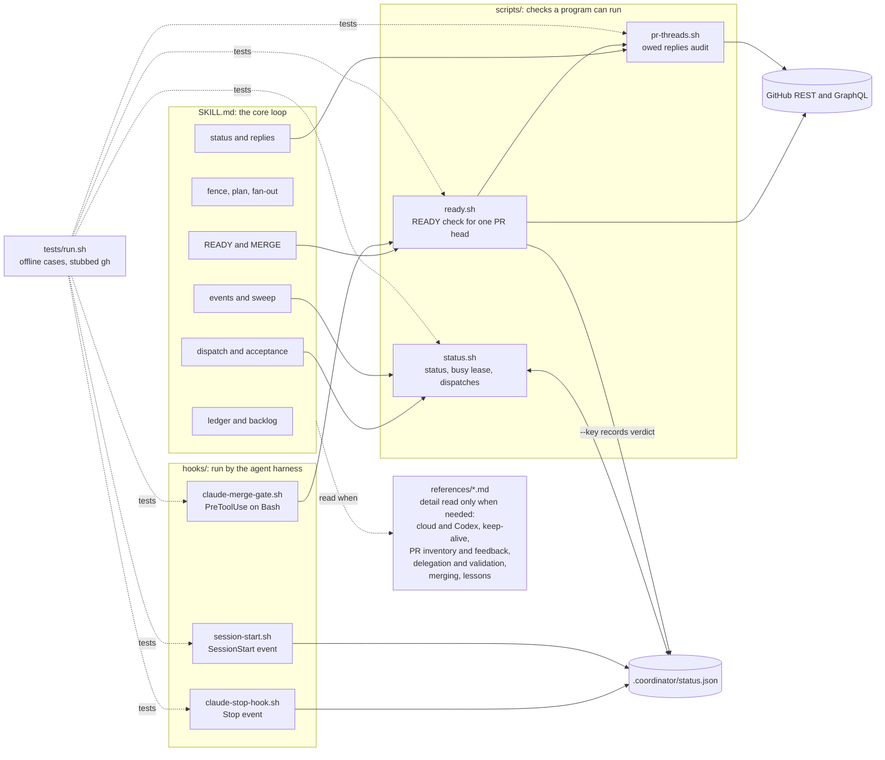

## 2. The four operating layers

Each layer covers a time when the layer above it cannot act (see the layer table in `references/keepalive.md`).

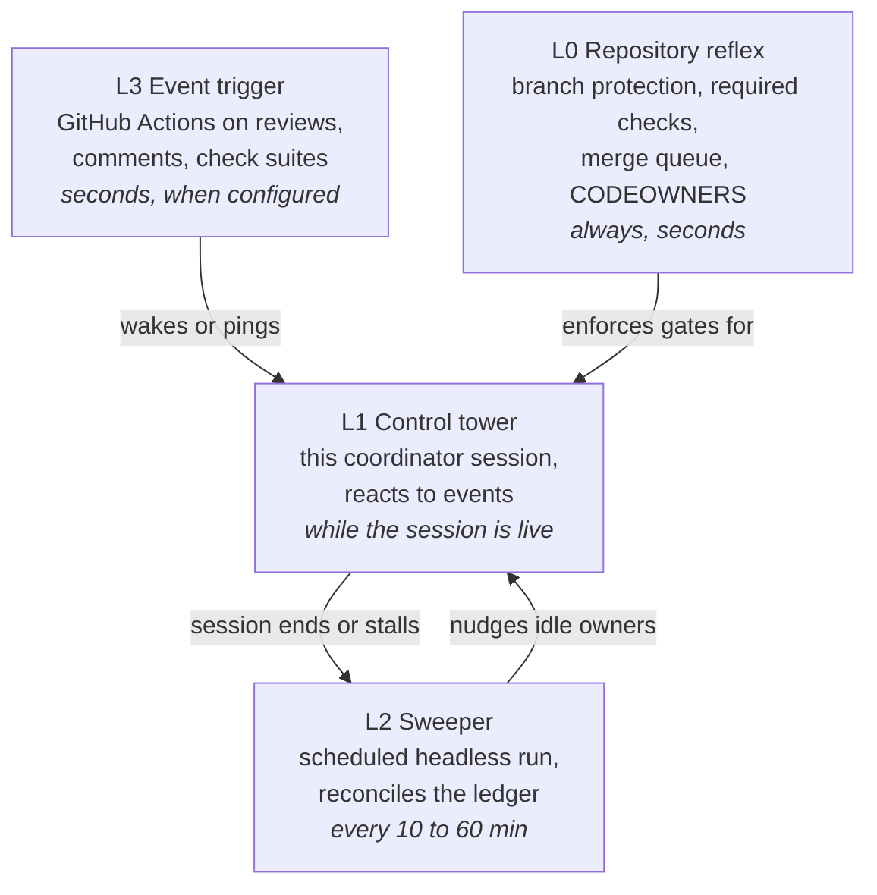

## 3. Lifecycle of one piece of work

The coordinator plans, sends independent tasks to executors in parallel, checks each claim of "done" itself, and merges only through the READY fence. A failure at any check sends the task back to its executor.

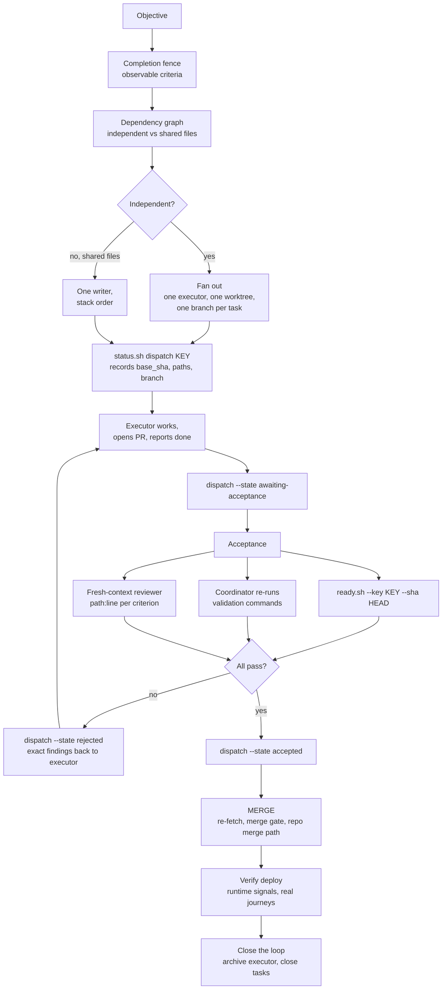

## 4. Dispatch records

`status.sh` refuses `accepted` (exit 4) until `ready.sh --key` has recorded a passing READY check for that dispatch. The verdict must cover the current PR head, the dispatch paths and its run, and must not come from `--allow-pending`. A change to the dispatch PR, paths or run clears the verdict.

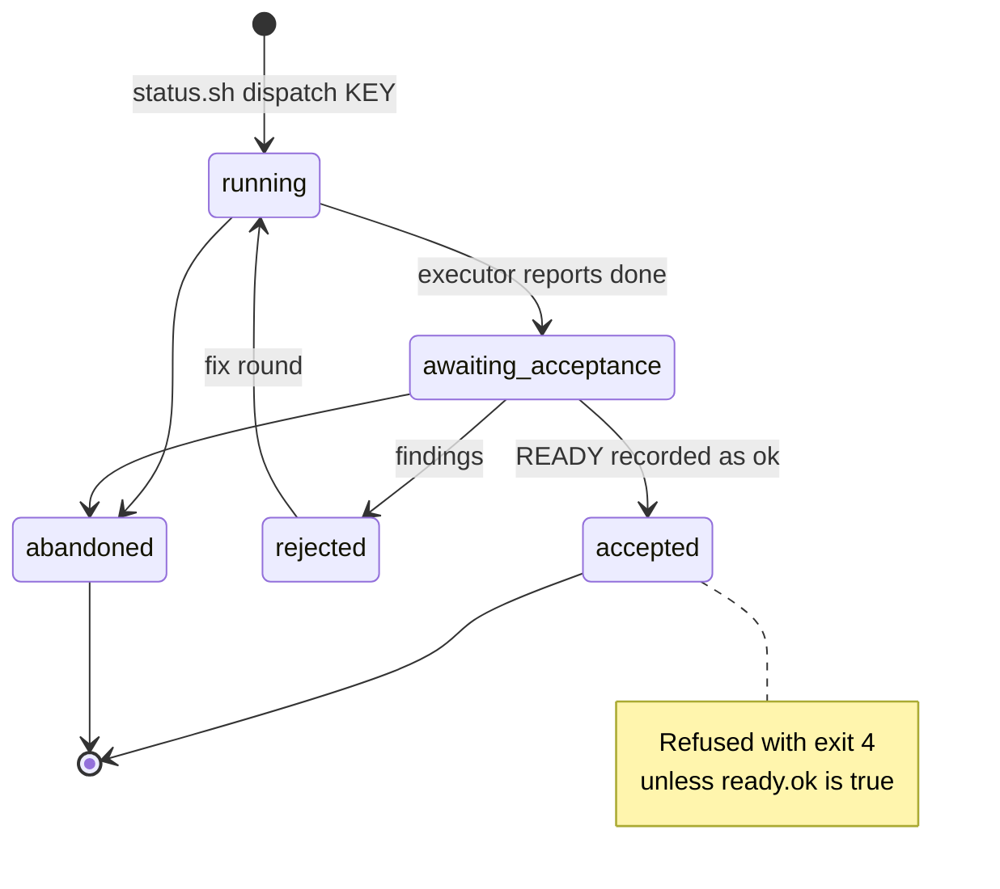

## 5. The merge gate

The gate runs before every shell command. It finds `gh pr merge` and REST merge calls, runs `ready.sh` on the current head, and blocks the command when the fence is not met. It fails closed: a merge it cannot place is blocked.

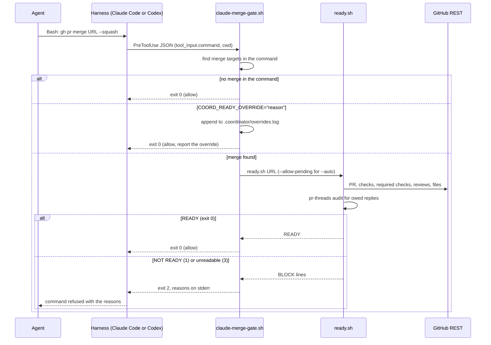

What `ready.sh` blocks on, and what it only warns about:

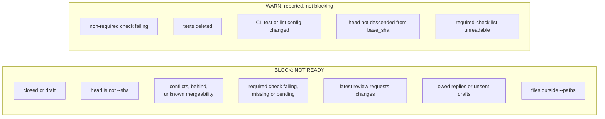

## 6. Keep-alive

Each session writes its state with `status.sh set`. The Stop hook reads it when the agent tries to end its turn. While the state is `active`, the hook sends the next action back as a new prompt.

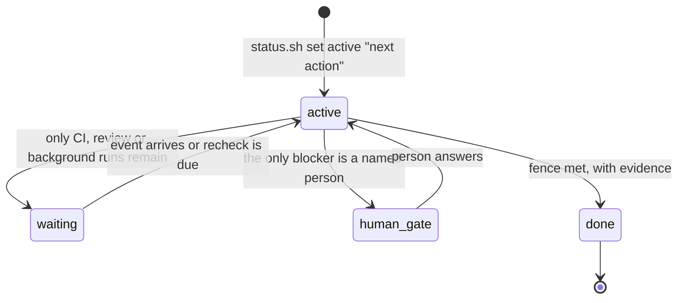

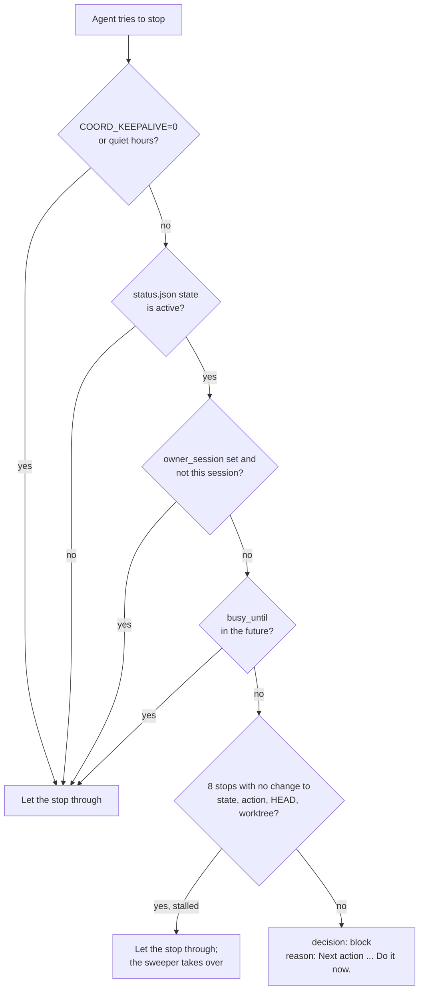

The SessionStart hook covers the other end: a new, resumed or compacted session. While the state is `active`, `waiting` or `human-gate`, it adds the state, next action and open dispatches as context, and says to read the skill and the ledger first. After `resume` or `compact` it also says to run the sweep first. When another session owns the status, it says not to take over. It never blocks, and it prints nothing when the state is `done` or there is no status.

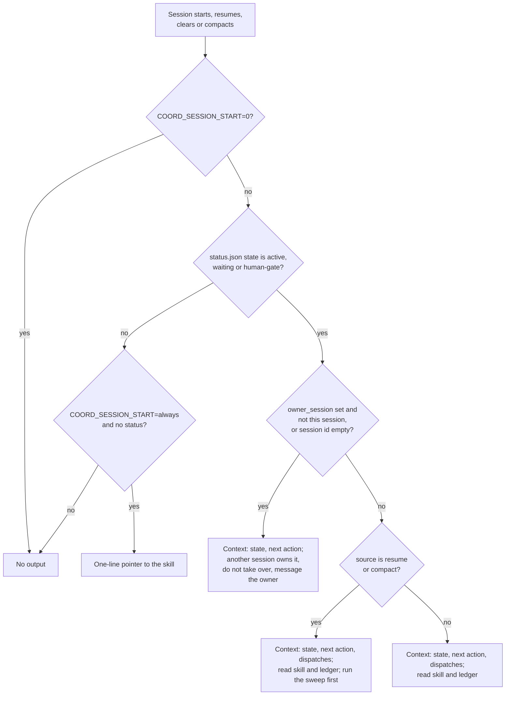

## 7. Review-thread audit

`pr-threads.sh` sorts every piece of review feedback into one of four categories: `ACTION`, `AWAITING`, `UNSENT` or `INFO`. It skips resolved threads. `INFO` marks a bot notice that needs no reply, such as a spent review quota (`COORD_NOTICE_PATTERNS`); it is listed but never blocks READY. A reply counts as the agent's only when it carries `AGENT_MARKER` (default `🤖` or the Claude Code footer).

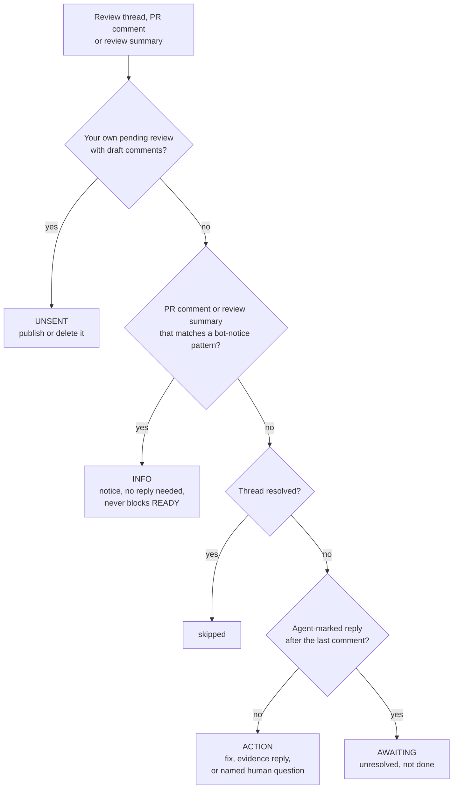

## 8. Claude Code and Codex

Both harnesses send the same hook JSON, so one set of hooks serves both. The differences are in how sessions start and how a session knows its own id.

```mermaid
flowchart LR
  subgraph Shared["Same in both"]
    direction TB
    X1["SKILL.md rules"]
    X2["scripts/*.sh"]
    X3["hooks/*.sh<br/>PreToolUse matcher Bash,<br/>Stop decision: block,<br/>SessionStart additionalContext"]
  end
  subgraph Claude["Claude Code"]
    direction TB
    C1["install: ~/.claude/skills/"]
    C2["hooks: .claude/settings.json"]
    C3["start: claude -p<br/>cloud: create_session"]
    C4["resume: claude --resume ID -p"]
    C5["id: CLAUDE_CODE_SESSION_ID"]
    C6["repo rules: CLAUDE.md"]
  end
  subgraph Codex["Codex"]
    direction TB
    D1["install: ~/.agents/skills/"]
    D2["hooks: .codex/hooks.json<br/>trusted project"]
    D3["start: codex exec --sandbox workspace-write<br/>cloud: codex cloud exec --env"]
    D4["resume: codex exec resume ID"]
    D5["id: CODEX_THREAD_ID"]
    D6["repo rules: AGENTS.md"]
  end
  Claude --- Shared --- Codex
```

A child agent inherits its parent's environment. So a Codex executor started by a Claude coordinator sees both ids. `status.sh` picks the id that belongs to the nearest agent process:

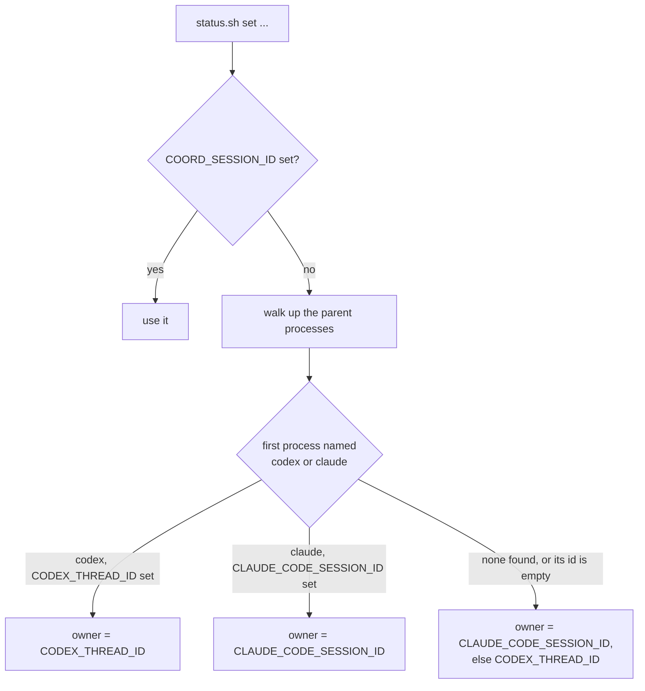
